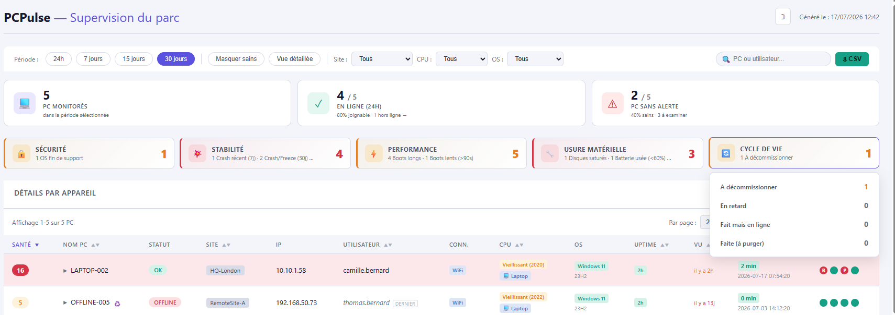

# PCPulse

[](LICENSE)
[](https://learn.microsoft.com/powershell/)
[](.)
[](CHANGELOG.md)
[](.)

> **Zero-dependency Windows fleet monitoring.**
> One PowerShell script to collect, one PowerShell script to render a self-contained HTML dashboard. That's it.

🇫🇷 [Version française](README.md)


> **Note:** the dashboard UI is in French. An English localization is on the roadmap. The rest of the documentation is available in English below.

---

## 🤔 What is PCPulse?

A **Windows fleet monitoring tool** for IT teams who want a fleet health snapshot **without deploying Zabbix, SCCM, or buying a $30k/year solution**.

- **Two PowerShell scripts**, nothing else.
- **No database**, no service, no installed agent.
- **A shared SMB folder** serves as storage.
- **A self-contained HTML report** generated on demand, openable on any PC.

## 💡 Why I'm building this

Three reasons, in this order:

1. **Curiosity and learning.** PCPulse is my first real coding project. It's an opportunity to confront real questions: how to think about a data schema that survives evolutions? How to manage a deployment on production endpoints? How to write docs that are actually useful? Etc.

2. **Wanting to give back to open source.** I use free software every day at work. At my modest scale, I'd like to give back a small part of what I receive.

3. **A real-world need.** I manage a fleet of several hundred Windows endpoints and I needed this tool. Rather than depending on a contractor or buying an off-the-shelf solution full of features I'd never use, I preferred to code exactly what I needed. PCPulse is therefore used in production, which forces it to be solid and pragmatic.

If any of these resonate with you, feel free to open an [Issue](https://github.com/Damien-Gouhier/pcpulse/issues) to discuss, contribute, or just share your feedback.

## ✨ What's collected on each PC

| Category | Metrics |
|---|---|
| 🔒 **Security** | EDR status (defined in config.psd1): stopped / absent; OS end-of-support |
| ⚠️ **Stability** | Application crashes, freezes, BSODs, WHEA fatal/corrected, GPU TDR, thermal throttling |
| ⚡ **Performance** | Boot duration, detailed Boot Performance (MainPath, PostBoot, UserProfile, Explorer init) |
| 🔧 **Hardware wear** | Battery health (wear % + cycles), Disk SMART (wear, temp, errors), aging secondary monitors |
| 💻 **OS** | Windows 10 vs 11 (derived from build), edition, feature update — fleet inventory / end-of-support tracking |
| 👤 **User** | Current session, or last logged-on user as fallback (single entry, not a history) |
| 📊 **Inventory** | Machine model & manufacturer (e.g. Dell Inspiron 7490 — search and filter by model, fleet breakdown), serial (service tag), CPU (model, year, age category), RAM (modules: type, JEDEC-decoded vendor, upgrade headroom), disks, chassis (Laptop/Desktop/AIO), external monitors (EDID; screens flagged "unidentified" when a dock/adapter doesn't relay EDID) |

## 📸 Preview

One row per PC. Row color = alert level. Sort, filters (period, site, CPU), search.


### Per-PC drill-down

Clicking a PC opens 5 tabs for deep-dive: Overview, Stability, Boot, Hardware, Security.


### Fleet-wide aggregates

Boot type distribution, cross-fleet top crashers, secondary monitor inventory.


## 🚀 Quick Start — try it in 3 minutes

Before deploying to your fleet, you can see the Dashboard **right now** with the 5 demo JSON files provided.

**Prerequisites**: Windows 10/11 + PowerShell 7 (`winget install Microsoft.PowerShell`).

```powershell
# 1. Clone the repo
git clone https://github.com/Damien-Gouhier/pcpulse.git
cd pcpulse

# 2. Re-anchor the demo dates to "now"
#    (demo JSONs have frozen dates; without this the Dashboard eventually
#     shows ALL endpoints as offline). Idempotent script.
pwsh .\examples\demo\Refresh-DemoDates.ps1

# 3. Run the Dashboard on demo JSONs
pwsh .\02_Dashboard.ps1 -SharePath ".\examples\demo"
```

> ℹ️ Step 2 is **idempotent**: run it as often as you like, it always re-anchors activity dates to the current time (one endpoint stays "offline" by design: `OFFLINE-005`). Without it, the JSONs' frozen dates would eventually push the whole demo fleet offline.

> 💡 **If Windows blocks execution** with `cannot be loaded... not digitally signed`, it's normal (default Windows protection). Two options:
>
> - **One-shot**: add `-ExecutionPolicy Bypass` → `pwsh -ExecutionPolicy Bypass -File .\02_Dashboard.ps1 -SharePath ".\examples\demo"`
> - **Permanent (recommended)**: run once as admin `Set-ExecutionPolicy -Scope CurrentUser -ExecutionPolicy RemoteSigned`

The HTML opens automatically in your browser. Explore the 5 example scenarios:

- `LAPTOP-001` → Healthy case (all green)
- `LAPTOP-002` → Multiple alerts (dead battery + BSOD + crashes + PCIe errors)
- `DESKTOP-003` → Aging desktop, disk almost full
- `AIO-004` → All-In-One with an 8-year-old secondary monitor
- `OFFLINE-005` → Laptop not seen for 13 days

## 🏗️ Architecture

```
┌──────────────────────────────────────────────────────────┐
│                     DEPLOYMENT                           │
│   (Intune, SmartDeploy, GPO, or manual scheduled task)   │
└─────────────────────┬────────────────────────────────────┘
                      │
                      ▼
     ┌────────────────────────────────────┐
     │   01_Collector.ps1 on each PC      │
     │   • Scheduled task (SYSTEM/gMSA)   │
     │   • Runs every 1-4h                │
     │   • Random anti-collision delay    │
     └────────────────┬───────────────────┘
                      │ writes
                      ▼
            ┌──────────────────────┐
            │   \\SERVER\share\    │
            │   ├─ release\        │ ◄── read-only for clients
            │   │   ├─ 01_Collector.ps1
            │   │   ├─ PCPulse-Updater.ps1
            │   │   ├─ version.txt
            │   │   └─ KILLSWITCH.txt (optional)
            │   ├─ killed\         │
            │   ├─ logs\           │
            │   ├─ PC1.json        │
            │   ├─ PC2.json        │
            │   └─ ...             │
            └──────────┬───────────┘
                       │ reads
                       ▼
     ┌────────────────────────────────────┐
     │   02_Dashboard.ps1 (admin host)    │
     │   • PowerShell 7                   │
     │   • On demand                      │
     │   • Generates a self-contained HTML│
     └────────────────┬───────────────────┘
                      │
                      ▼
           🌐 PCPulse-Dashboard-*.html
```

### Key characteristics

- **Zero external dependencies**: only native PowerShell and inline HTML/CSS/JS. The generated HTML is self-contained (no CDN, works offline).
- **PS 5.1 compatible** on the Collector side (= native Windows 10/11 fleet, no prerequisite install).
- **Atomic writes**: if the SMB share is unavailable, the Collector buffers locally and catches up on the next run.
- **Backward compatible**: the Dashboard accepts JSON schemas 2.1 and 2.2 (during the gradual per-machine rollout).
- **Auto-update**: `PCPulse-Updater.ps1` automatically pulls the latest Collector from `\release\` with SHA256 verification.
- **Killswitch**: remote uninstall via a sentinel file (see below).

## ⚙️ Configuration

Two optional files, placed in `$SharePath` (default `C:\PCPulse`):

- **`config.psd1`** — thresholds, score weights, dashboard title, custom killswitch, etc.
  See [`config.psd1.example`](config.psd1.example) as a documented template.
- **`ip-ranges.csv`** — IP → Site mapping (optional, enables the Site column).
  See [`ip-ranges.example.csv`](ip-ranges.example.csv) and [`ip-ranges.README.md`](ip-ranges.README.md).

Both files are excluded from the repo via `.gitignore` to prevent accidental leaks of real data.

## ☠️ Killswitch — remote uninstall

PCPulse ships with a **killswitch** mechanism that allows you to uninstall Collectors from your entire fleet remotely, without physically touching any machine.

**Use cases**:
- Decommission PCPulse cleanly (replace with another tool)
- Emergency stop if a critical bug is detected
- Major migration (kill v1 → install v2 cleanly)

**How it works**:
1. You drop a sentinel file `KILLSWITCH.txt` in `\\SERVER\PCPulse$\release\` containing the phrase `CONFIRM-UNINSTALL-PCPULSE`
2. On the next hourly cycle, each PC:
   - Detects the file
   - Writes a report to `\killed\<HOSTNAME>.txt`
   - Removes its scheduled task
   - Deletes its `C:\ProgramData\PCPulse\` folder
3. You remove the sentinel file once all PCs have appeared in `\killed\`

**In production**, change the phrase and filename via `config.psd1` to prevent any accidental triggering. See [`config.psd1.example`](config.psd1.example) and [`SECURITY.md`](SECURITY.md) for details.

## 🔄 Decommissioning — endpoint lifecycle

> 🚧 **Work in progress.** A recent, **additive** addition (no impact on collection or the JSON schema) that is **meant to evolve**: the workflow, states and UX will change based on feedback. Automatic purge of retired endpoints isn't there yet (see below).



When an endpoint is replaced, stolen or reaches end-of-life, it keeps showing up in the Dashboard as "offline" — with no way to tell a real outage from an intentional retirement. Decommissioning removes that ambiguity.

The **`Decommission-PC.ps1`** tool marks an endpoint in a **separate registry** (`decommissioning.json`), with a small workflow:

- **To do → Done**: mark the endpoint (reason, assigned technician, target date), then close it once the operation is complete. Timestamped history kept.
- **Separate registry, never inside the endpoint's JSON**: the Collector rewrites the JSON on every cycle while the machine is alive, so the marker can't live there.
- **Written with a normal account**: the registry lives in a folder where technicians already have write access with their **regular session account** (outside the hardened share) — no credentials, no elevation. Non-sensitive settings (technician list, admins allowed to postpone/remove, grace delay) live in `decom-config.psd1` next to the registry (see [`decom-config.psd1.example`](decom-config.psd1.example)).

On the Dashboard side, a **Lifecycle** KPI family reads this registry (path via `DecommissionRegistryPath`) and shows a per-endpoint badge: *to decommission* (with countdown), *overdue*, *done but still online* (inconsistency to check), *done (to purge)*. A per-state filter lists the relevant endpoints.

An aggregate **"Fleet lifecycle"** panel also derives audit stats from the full registry (including already-purged endpoints): decommissioned / to do / overdue, **average mark→done delay**, and a breakdown **by technician** and **by month** — handy for a status check or reporting.

**Current limitation (to evolve)**: once an endpoint is marked "Done", its `<PC>.json` is **not** deleted automatically — you remove it manually on the share (with an account that has write access). The *"done (to purge)"* filter exists precisely to list what's left to clean up. Automatic purge (a server-side scheduled task, after a delay) is being considered.

## 🎯 Who is this for?

- **SMB/mid-market sysadmins** (50 to 2000 endpoints) without budget for a commercial monitoring solution
- **Public sector IT teams** (public / para-public organizations) with heterogeneous fleets
- **MSPs / managed service providers** who want a lightweight tool to deploy at multiple clients
- **Homelab / curious sysadmins** who just want to see their machines' health

**Not suitable for**:

- Real-time monitoring (this is a periodic snapshot, not a live feed)
- Push alerting (no Slack / email notifications — it's a dashboard)
- Linux / macOS fleets (Windows only)

## 📦 Deploying to a real fleet

The [Quick Start](#-quick-start--try-it-in-3-minutes) isn't enough for production. For a real rollout:

1. Set up an **SMB share** on a Windows server (prefer encrypted SMB3)
2. Run **`Setup-Server.ps1`** on the server to create the structure and hardened ACLs (admin account required, see [`SECURITY.md`](SECURITY.md) for details)
3. Deploy `01_Collector.ps1` + `PCPulse-Updater.ps1` to each endpoint via Intune, SmartDeploy, GPO, etc.
4. Create a **scheduled task** that calls `PCPulse-Updater.ps1 -SharePath \\SERVER\PCPulse$` every 1-4h (as SYSTEM or via gMSA)
5. Configure `config.psd1` and `ip-ranges.csv` to match your environment
6. Run `02_Dashboard.ps1` on demand from an admin host with PowerShell 7

👉 Detailed install guide: [`docs/INSTALL.md`](docs/INSTALL.md). More docs coming (DEPLOYMENT-INTUNE, DEPLOYMENT-SMARTDEPLOY, TROUBLESHOOTING).

## 🔐 Security

PCPulse is built to be **deployed on production endpoints**, with a *pull*-based
auto-update mechanism (endpoints pull from a share). That vector is the sensitive
part of the model — so it has been **hardened in depth**:

- **Signed & pinned update chain.** Collector and Updater are Authenticode-signed.
  Before executing anything, the Updater verifies the signature against a **pinned
  thumbprint**: the pin is the trust anchor, independent of OS chain trust.
- **TOCTOU-safe verification.** The signature is checked on the **bytes actually
  installed** (verified local copy → atomic rename), not on the remote file. Write
  access to the share is **not enough** to run arbitrary code. SHA256 is now just a
  change detector; the barrier is the signature.
- **Anti-downgrade.** Updater and Collector read their version **from the signed
  file** and refuse any older version → no re-injection of an old (yet signed) binary.
- **Atomic install, zero backup.** Copy → verify → rename: the live file is never
  replaced by a partial copy, and no old binary is left on endpoints (smaller
  exploitable surface).
- **Endpoint hardening.** Housekeeping every cycle (no exploitable trace left on the
  endpoint), runtime folder ACL reduced to SYSTEM + Administrators, logs offloaded to
  the share, and **self-healing** logs (a corrupted log can't block collection).
- **Dashboard.** XSS defense (single escaping at embed + per-field allowlist, CSP
  `connect-src 'none'`) and robustness (one corrupted JSON no longer breaks the whole
  build).
- **Reduced surface.** Config **read-only** for endpoints (in `release\`), killswitch
  **opt-in** (disabled by default).

→ **Before any deployment**, read [`SECURITY.md`](SECURITY.md): trust model,
recommended ACLs (and the attack scenario they close), killswitch threat model, and
how to **report a vulnerability**. `Setup-Server.ps1` applies the recommended hardened
ACLs on an existing share.

*Still on the roadmap: switching endpoints to `AllSigned` execution policy and
deploying certificate chain trust (GPO) — pinning already guarantees authenticity
without them.*

## 🛠️ Tech stack

- **PowerShell 5.1** (Collector) / **PowerShell 7** (Dashboard)
- **WMI / CIM** for hardware telemetry
- **Get-WinEvent** for event logs
- **Vanilla HTML / CSS / JS** for the Dashboard (no framework, no bundler)
- **JSON** as exchange format (Collector → Dashboard)

## 🤝 Contributing

Contributions are welcome! To discuss an idea, report a bug, or propose an improvement, open a [GitHub Issue](https://github.com/Damien-Gouhier/pcpulse/issues).

For a Pull Request:

1. Fork the repo
2. Create a branch (`git checkout -b feature/my-feature`)
3. Commit with a clear message
4. Push and open the PR

The project is in **pilot phase**: the roadmap adapts based on field feedback.

## 📄 License

[MIT](LICENSE) — Copyright (c) 2026 Damien Gouhier.

You can use, modify and redistribute this project freely, including in commercial contexts, as long as you keep the copyright notice.

---

*PCPulse — because a healthy fleet is a fleet where users stop calling support.* 💙
