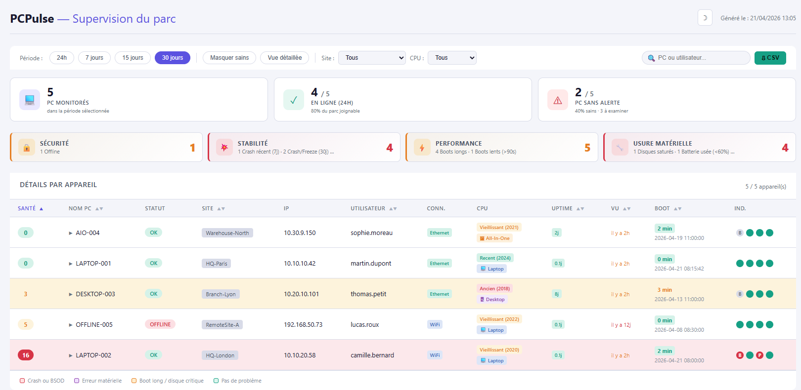
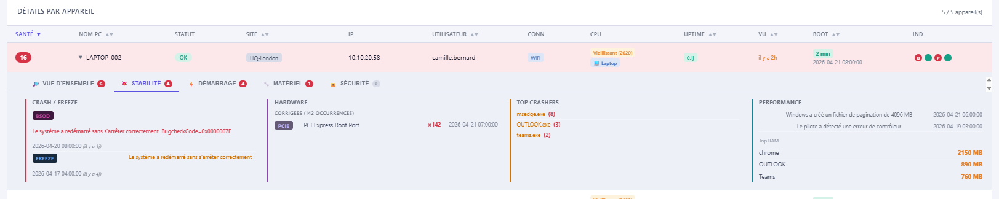
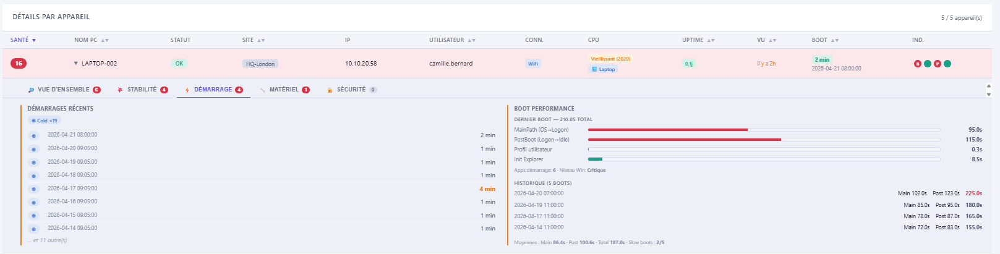
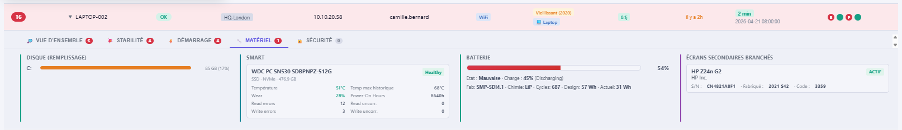
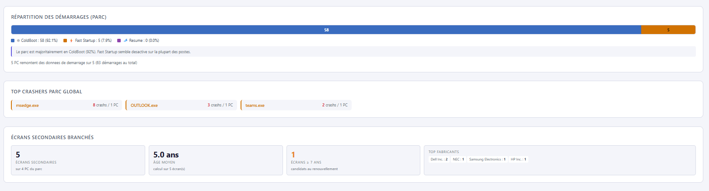

# PCPulse

[](LICENSE)
[](https://learn.microsoft.com/powershell/)
[]()
[](CHANGELOG.md)
[]()

> **Supervision de parc Windows zéro-dépendance.**
> Un script PowerShell qui collecte, un script PowerShell qui génère un dashboard HTML autonome. C'est tout.

🇬🇧 [English version](README.en.md)



---

## 🤔 C'est quoi PCPulse ?

Un outil de **supervision de parc Windows** pensé pour les DSI et équipes IT qui veulent un état de santé du parc **sans déployer Zabbix, SCCM, ou acheter une solution à 30k€/an**.

- **Deux scripts PowerShell**, c'est tout.
- **Pas de base de données**, pas de service, pas d'agent installé.
- **Un dossier partagé SMB** fait office de stockage.
- **Un rapport HTML autonome** généré à la demande, ouvrable sur n'importe quel PC.

## ✨ Ce qui est collecté sur chaque PC

| Famille | Métriques |
|---|---|
| 🔒 **Sécurité** | Statut EDR (SentinelOne), PC offline |
| ⚠️ **Stabilité** | Crashs applicatifs, freezes, BSOD, WHEA fatal/corrected, GPU TDR, throttling thermique |
| ⚡ **Performance** | Durée des boots, Boot Performance détaillée (MainPath, PostBoot, UserProfile, Explorer init) |
| 🔧 **Usure matérielle** | Santé batterie (% d'usure + cycles), SMART disque (wear, temp, erreurs), écrans secondaires âgés |
| 📊 **Inventaire** | CPU (modèle, année, ancienneté), RAM, disques, châssis (Laptop/Desktop/AIO), moniteurs externes (EDID) |

## 📸 Aperçu

### Vue d'ensemble du parc

Chaque ligne = un PC. Couleur de fond = niveau d'alerte. Tri, filtres (période, site, CPU), recherche.


### Drill-down par PC

Cliquer sur un PC ouvre 5 onglets pour creuser : Vue d'ensemble, Stabilité, Démarrage, Matériel, Sécurité.







### Panneaux agrégés parc

Répartition des types de démarrage, top crashers transverse, inventaire des écrans secondaires du parc.



## 🚀 Quick Start — tester en 3 minutes

Avant d'installer sur ton parc, tu peux voir le Dashboard **tout de suite** avec les 5 JSON de démo fournis.

**Prérequis** : Windows 10/11 + PowerShell 7 (`winget install Microsoft.PowerShell`).

```powershell
# 1. Cloner le repo
git clone https://github.com/Damien-Gouhier/pcpulse.git
cd pcpulse

# 2. Lancer le Dashboard sur les JSON de démo
pwsh .\02_Dashboard.ps1 -SharePath ".\examples\demo"
```

> 💡 **Si Windows bloque l'exécution** avec une erreur `cannot be loaded... not digitally signed`, c'est normal (protection par défaut). Deux solutions :
> - **Ponctuel** : ajouter `-ExecutionPolicy Bypass` → `pwsh -ExecutionPolicy Bypass -File .\02_Dashboard.ps1 -SharePath ".\examples\demo"`
> - **Permanent (conseillé)** : lancer une fois en admin `Set-ExecutionPolicy -Scope CurrentUser -ExecutionPolicy RemoteSigned`

Le HTML s'ouvre automatiquement dans ton navigateur. Tu peux explorer les 5 scénarios d'exemple :

- `LAPTOP-001` → Cas sain (tout vert)
- `LAPTOP-002` → Plein d'alertes (batterie HS + BSOD + crashs + erreurs PCIe)
- `DESKTOP-003` → Desktop ancien, disque saturé
- `AIO-004` → All-In-One avec écran secondaire vieux de 8 ans
- `OFFLINE-005` → Laptop pas vu depuis 12 jours

## 🏗️ Architecture

```
┌──────────────────────────────────────────────────────────┐
│                     DÉPLOIEMENT                          │
│  (Intune, SmartDeploy, GPO, ou manuel via tâche planif.) │
└─────────────────────┬────────────────────────────────────┘
                      │
                      ▼
     ┌────────────────────────────────────┐
     │   01_Collector.ps1 sur chaque PC   │
     │   • Tâche planifiée (SYSTEM)       │
     │   • Exécution toutes les 1-4h      │
     │   • Délai anti-collision aléatoire │
     └────────────────┬───────────────────┘
                      │ écrit
                      ▼
            ┌──────────────────────┐
            │   \\SERVER\share\    │
            │   ├─ PC1.json        │
            │   ├─ PC2.json        │
            │   ├─ PC3.json        │
            │   └─ ...             │
            └──────────┬───────────┘
                       │ lit
                       ▼
     ┌────────────────────────────────────┐
     │   02_Dashboard.ps1 (poste admin)   │
     │   • PowerShell 7                   │
     │   • À la demande                   │
     │   • Génère un HTML autonome        │
     └────────────────┬───────────────────┘
                      │
                      ▼
           🌐 PCPulse-Dashboard-*.html
```

### Caractéristiques clés

- **Zéro dépendance externe** : que du PowerShell natif et HTML/CSS/JS inline. Le HTML produit est autonome (aucun CDN, fonctionne offline).
- **Compatible PS 5.1** côté Collector (= parc Windows 10/11 natif, aucune installation préalable).
- **Lecture atomique** : si le partage SMB est indisponible, le Collector bufferise localement et rattrape au prochain run.
- **Rétrocompatible** : le Dashboard accepte les schemas JSON plus anciens au fur et à mesure des évolutions.

## ⚙️ Configuration

Deux fichiers optionnels, à placer dans `$SharePath` (par défaut `C:\PCPulse`) :

- **`config.psd1`** — seuils, pondération du score, titre du Dashboard, etc.
  Voir [`config.psd1.example`](config.psd1.example) comme modèle documenté.
- **`ip-ranges.csv`** — mapping IP / hostname → Site (optionnel, active la colonne Site).
  Voir [`ip-ranges.example.csv`](ip-ranges.example.csv) et [`ip-ranges.README.md`](ip-ranges.README.md).

Les deux fichiers sont exclus du repo via `.gitignore` pour éviter les fuites accidentelles de données réelles.

## 🎯 À qui ça s'adresse

- **Admins sys de PME/ETI** (50 à 2000 postes) qui n'ont pas de budget pour une solution de supervision commerciale
- **DSI de collectivités publiques** (secteur public / parapublic) avec parcs hétérogènes
- **MSP / infogéreurs** qui veulent un outil léger à déployer chez plusieurs clients
- **Homelab / sysadmins curieux** qui veulent juste voir l'état de leurs machines

**Pas adapté pour** :
- Monitoring temps réel (c'est un snapshot périodique, pas un flux)
- Alerting push (pas de notifications Slack / email — c'est un dashboard)
- Parcs Linux / Mac (Windows only)

## 📦 Déploiement sur un vrai parc

La [Quick Start](#-quick-start--tester-en-3-minutes) ne suffit pas à déployer en prod. Pour un déploiement réel :

1. Mettre en place un **partage SMB** accessible en écriture par les comptes machine du parc (authentification Kerberos)
2. Déployer `01_Collector.ps1` sur chaque endpoint + créer une **tâche planifiée SYSTEM** (via Intune, SmartDeploy, GPO…)
3. Configurer `config.psd1` et `ip-ranges.csv` pour adapter à ton environnement
4. Exécuter `02_Dashboard.ps1` à la demande depuis un poste admin avec PowerShell 7

👉 Documentation détaillée à venir dans `docs/` (INSTALL, DEPLOYMENT-INTUNE, DEPLOYMENT-SMARTDEPLOY, TROUBLESHOOTING, SECURITY).

## 🛠️ Stack technique

- **PowerShell 5.1** (Collector) / **PowerShell 7** (Dashboard)
- **WMI / CIM** pour la télémétrie matérielle
- **Get-WinEvent** pour les journaux d'événements
- **HTML / CSS / JS vanilla** pour le Dashboard (pas de framework, pas de bundler)
- **JSON** comme format d'échange (Collector → Dashboard)

## 🤝 Contribuer

Les contributions sont bienvenues ! Pour discuter d'une idée, d'un bug, ou d'une amélioration, ouvre une [Issue GitHub](https://github.com/Damien-Gouhier/pcpulse/issues).

Pour une Pull Request :
1. Fork le repo
2. Crée une branche (`git checkout -b feature/ma-feature`)
3. Commit tes changements avec un message clair
4. Push et ouvre la PR

Le projet est en phase **pilote** : la roadmap s'adaptera selon les retours terrain.

## 📄 Licence

[MIT](LICENSE) — Copyright (c) 2026 Damien Gouhier.

Tu peux utiliser, modifier et redistribuer ce projet librement, y compris dans un contexte commercial, à condition de garder la mention de copyright.

---

*PCPulse — parce qu'un parc en bonne santé, c'est un parc où les utilisateurs arrêtent d'appeler le support.* 💙
